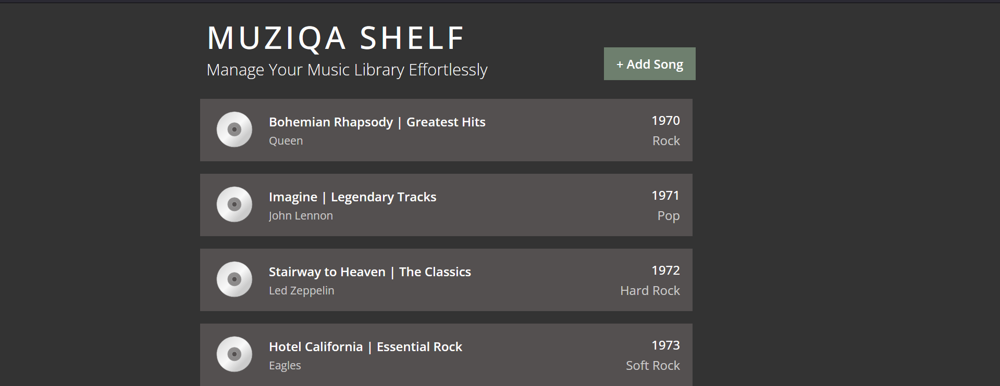

# Muziqa Shelf



A full-stack music library management app built with React, Redux Toolkit, Redux-Saga, MirageJS, and Styled Components.

---

## Features

- **Paginated Song List:** View songs with title, artist, album, year, and genre.
- **CRUD Operations:** Add, edit, and delete songs via API calls.
- **Responsive UI:** Styled with Styled Components and CSS for mobile and desktop.
- **State Management:** Redux Toolkit for global state, Redux-Saga for side effects.
- **Custom Webpack Setup:** No CRA, manual configuration with environment variables and custom rules.
- **Mock Backend:** MirageJS simulates a REST API for local development.

---

## Technologies Used

- **ReactJS** (functional components, hooks)
- **Redux Toolkit** & **Redux-Saga**
- **Styled Components** (for theming and responsive styling)
- **MirageJS** (mock backend)
- **Webpack** (manual config, no CRA)

---

## Setup Instructions

1. **Clone the repository:**
   ```bash
   git clone https://github.com/flavnat/muziqa-shelf.git
   cd muziqa-shelf
   ```
2. **Install dependencies:**
   ```bash
   npm install
   ```
3. **Copy the example environment file and create your own .env:**
   ```bash
   cp .env.example .env
   ```

- For development, ensure your environment is set to `NODE_ENV=development` (this is usually handled automatically when running `npm start`).
1. **Start the development server:**
   ```bash
   npm start
   ```
   The app will open at [http://localhost:3000](http://localhost:3000).

2. **Build for production:**
   ```bash
   npm run build
   ```

---

## API Endpoints (MirageJS)

All endpoints are prefixed with `/api` (or your `API_BASE_URL`).

| Method | Endpoint         | Description                | Body / Params         |
|--------|------------------|---------------------------|----------------------|
| GET    | `/songs`         | List songs (paginated)    | `?page=1&limit=10`   |
| GET    | `/songs/:id`     | Get song by ID            |                      |
| POST   | `/songs`         | Create new song           | `{ title, artist, album, year, genre }` |
| PUT    | `/songs/:id`     | Update song by ID         | `{ title, artist, album, year, genre }` |
| DELETE | `/songs/:id`     | Delete song by ID         |                      |

**Example Song Object:**
```json
{
  "id": 1,
  "title": "Bohemian Rhapsody",
  "artist": "Queen",
  "album": "Greatest Hits",
  "year": 1975,
  "genre": "Rock"
}
```

---

## Mock Data

- The mock song data used in MirageJS (titles, artists, albums, genres, etc.) was generated with the help of AI tools.

---

## Webpack Configuration

Your project uses a **custom Webpack setup** (see `webpack.config.js`) instead of Create React App. Here’s what each part does:

### 1. Entry and Output
- **entry:**
  ```js
  entry: './src/index.js',
  ```
  This is the main file where your app starts.

- **output:**
  ```js
  output: {
      path: path.resolve(__dirname, 'dist'),
      filename: 'bundle.js',
  },
  ```
  Webpack bundles your app into `dist/bundle.js` for production.

---

### 2. Module Rules
These tell Webpack how to handle different file types:

- **JavaScript/JSX (React) Files:**
  ```js
  {
      test: /\.[jt]sx?$/,
      exclude: /node_modules/,
      use: {
          loader: 'babel-loader',
          options: {
              presets: ['@babel/preset-env', '@babel/preset-react'],
          },
      },
      type: 'javascript/auto',
  }
  ```
  - Uses **Babel** to transpile modern JavaScript and JSX to code that works in all browsers.
  - Supports both `.js` and `.jsx` files.

- **CSS Files:**
  ```js
  {
      test: /\.css$/i,
      use: ['style-loader', 'css-loader'],
  }
  ```
  - Allows you to import CSS files directly into your JS.
  - `css-loader` interprets `@import` and `url()` in CSS.
  - `style-loader` injects CSS into the DOM.

---

### 3. Resolve
```js
resolve: {
    extensions: ['.js', '.jsx'],
},
```
- Lets you import files without specifying `.js` or `.jsx` extensions.

---

### 4. Plugins
- **dotenv-webpack:**
  ```js
  plugins: [
      new Dotenv(),
  ],
  ```
  - Loads environment variables from a `.env` file and makes them available in your code as `process.env.VARIABLE_NAME`.
  - Example: `API_BASE_URL` for your API endpoint.

---

### 5. Dev Server
```js
devServer: {
    static: {
        directory: path.join(__dirname, 'public'),
    },
    port: 3000,
    open: true,
    hot: true,
},
```
- **static.directory:** Serves static files from the `public` folder.
- **port:** Runs the dev server on port 3000.
- **open:** Automatically opens the app in your browser.
- **hot:** Enables hot module replacement (live reloading).

---

### 6. Custom Rules
- custom rules for:
  - **JS/JSX** (with Babel)
  - **CSS**
  - **Images (PNG, JPG, GIF):**
    ```js
    {
      test: /\.(png|jpe?g|gif)$/i,
      use: [
        {
          loader: 'file-loader',
          options: {
            name: '[name].[hash].[ext]',
            outputPath: 'images',
          },
        },
      ],
    }
    ```
    - Lets you import images in your JS/JSX files, e.g. `import logo from './logo.png'`.
  - **SVGs:**
    ```js
    {
      test: /\.svg$/i,
      use: [
        {
          loader: '@svgr/webpack',
          options: {
            svgo: true,
          },
        },
      ],
    }
    ```
    - Lets you import SVGs as React components, e.g. `import { ReactComponent as Logo } from './logo.svg'`.

---

**Summary Table:**

| Feature                | How it’s Handled                |
|------------------------|---------------------------------|
| React/JSX              | Babel loader + React preset     |
| CSS                    | style-loader, css-loader        |
| Env Variables          | dotenv-webpack                  |
| Dev Server             | webpack-dev-server              |
| Output                 | `dist/bundle.js`                |
| Static Files           | `public/`                       |

If you want to add more file types (like images or SVGs), you can add more rules to the `module.rules` array.

---

## State Management & Side Effects

- **Redux Toolkit** manages global state (`songs` slice).
- **Redux-Saga** handles async API calls (fetch, add, edit, delete songs).
- **React Hooks** (`useState`, `useEffect`, `useDispatch`, `useSelector`) for local and global state.

---

## Styling

- **Styled Components** for component-level styles and media queries.
- **Global CSS** for base styles.

---

## MirageJS Usage

MirageJS is started in `src/mirage/init.js`.
  
- Start MirageJS only in development:
    ```js
    if (process.env.NODE_ENV === "development") {
      const { makeServer } = require("./mirage/server");
      makeServer();
    }
    ```
  - This prevents Mirage from running in production builds.

---

## AI Tool Usage

- **AI Assistance:**
  - Some boilerplate, documentation (including this README), and mock data for MirageJS were generated with the help of AI tools (ChatGPT and QwenAI).

---
## Testing & Deployment

- **Testing:**
  - No automated tests included in this version.
---

## Commit History & Contribution

- Clear commit messages (e.g., `feat: add Redux store`, `fix: API error handling`).
---

### ⚠️ Mock Backend Notice

This app uses **MirageJS** to simulate a backend during development.  
All song data is stored in-memory and:
- Will reset on page refresh.
- Is not saved to a database.
- Exists only in the browser session.
